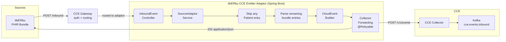
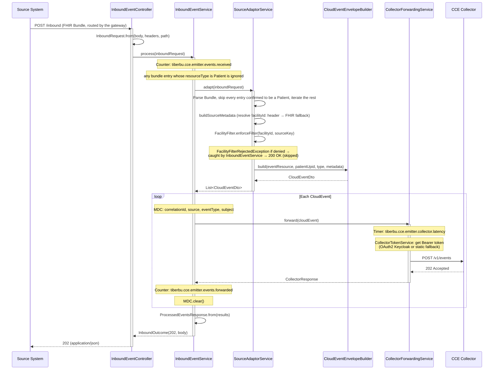
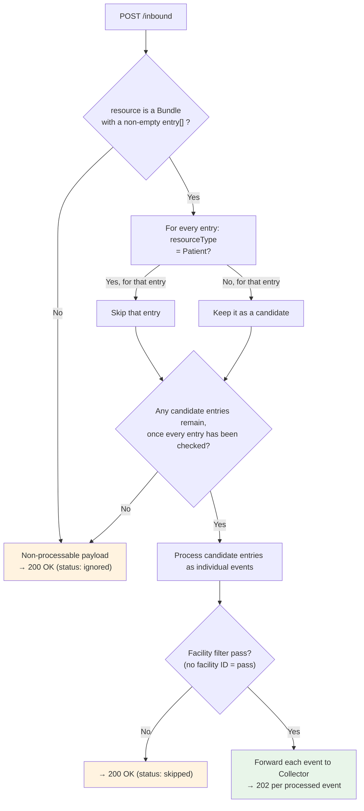
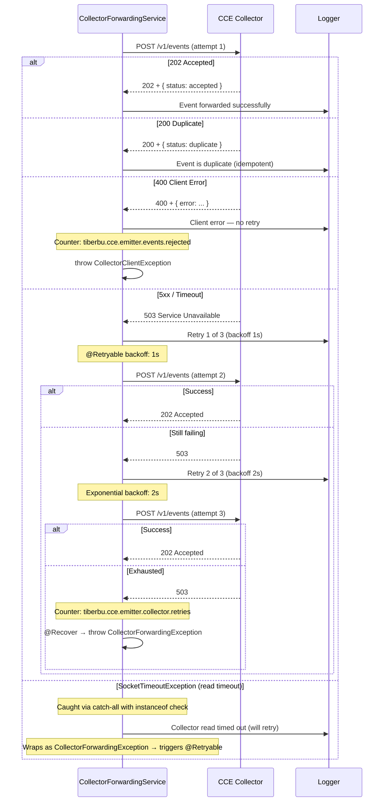
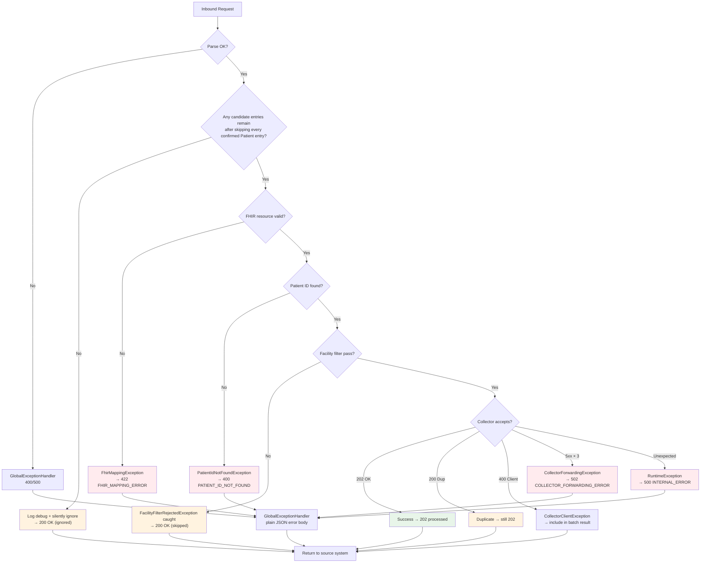
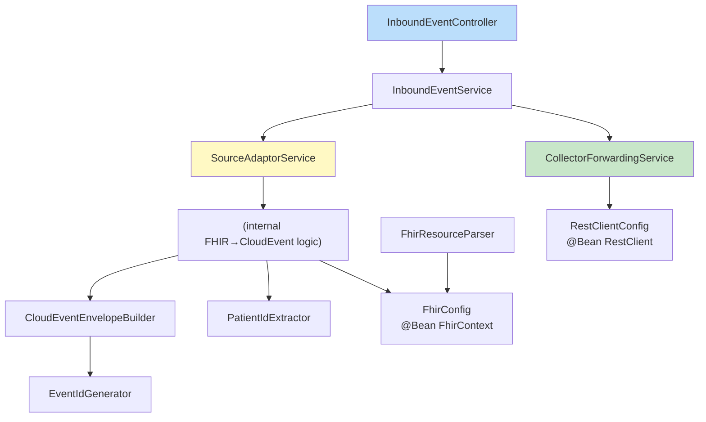
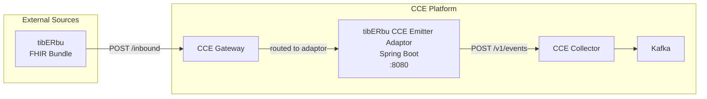

# tibERbu CCE Emitter Adaptor — Flow Diagrams

All diagrams use Mermaid notation.

## 1. End-to-End Event Flow

## 2. Request Processing Sequence

## 3. Bundle Processing & the Ignore / Skip Decision

There is no source-level filter — the source is fixed by `cce.emitter.source`. The only
two non-forwarding outcomes are `ignored` (the payload produced no events) and
`skipped` (the facility filter denied the event); both return `200 OK`.

## 4. Collector Forwarding with Retry

## 5. Error Handling Flow

## 6. Component Dependency Graph

## 7. Deployment Topology

