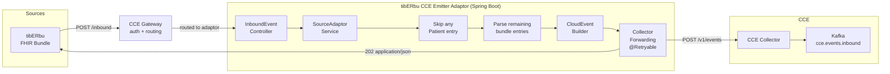
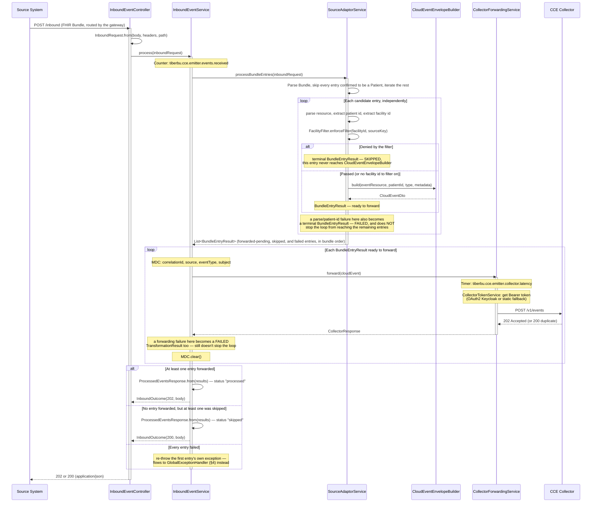
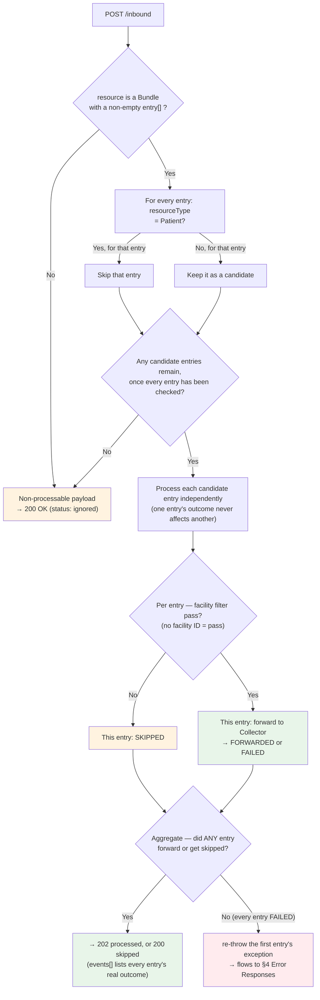
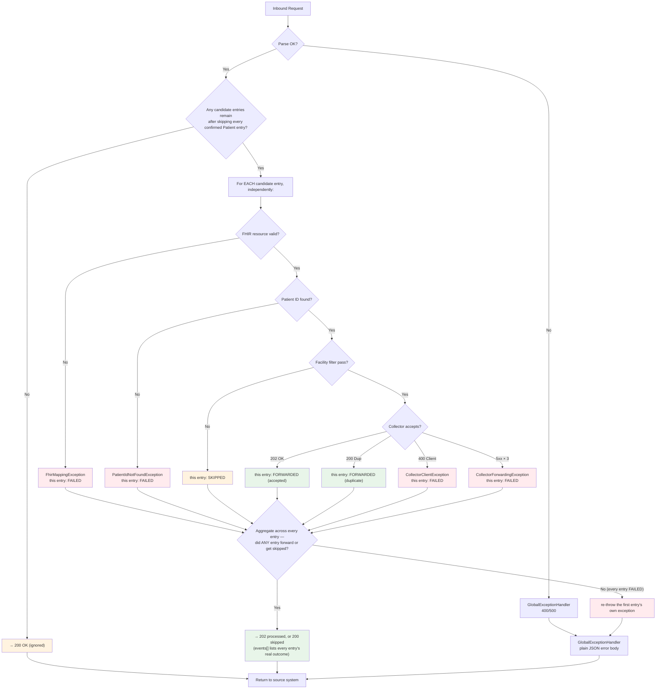
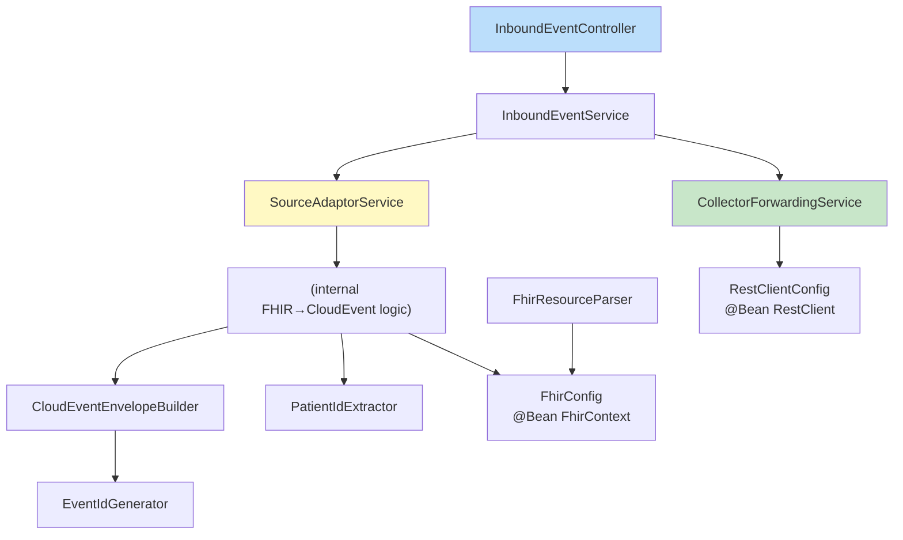
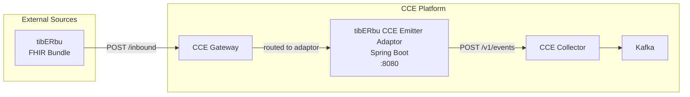

# tibERbu CCE Emitter Adaptor — Flow Diagrams

All diagrams use Mermaid notation.

## 1. End-to-End Event Flow

## 2. Request Processing Sequence

## 3. Bundle Processing & the Ignore / Skip Decision

There is no source-level filter — the source is fixed by `cce.emitter.source`. The only
two non-forwarding whole-request outcomes are `ignored` (the payload produced no candidate
entries at all) and `skipped` (at least one entry was facility-filtered and none reached
the Collector); both return `200 OK`. This diagram shows the per-entry decision that feeds
into that aggregate — see [§2](#2-request-processing-sequence) for how the per-entry results
combine into the final response, including the mixed-outcome case (some forwarded, some
skipped or failed, still `202`).

## 4. Collector Forwarding with Retry

## 5. Error Handling Flow

Every candidate entry reaches one of four per-entry outcomes independently — one
entry's parse/patient-id/filter/Collector failure never stops a sibling entry from
being attempted (see [§2](#2-request-processing-sequence)). Only once every candidate
entry in the bundle has reached a terminal per-entry outcome does the aggregation step
below decide the single response for the whole request.

## 6. Component Dependency Graph

## 7. Deployment Topology

